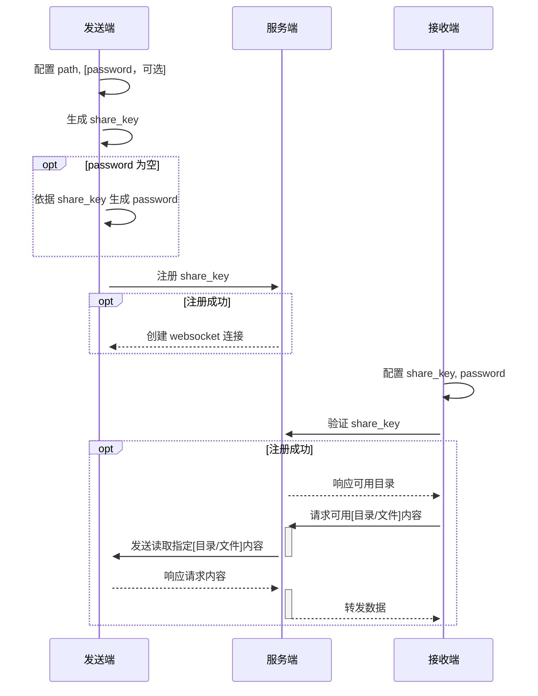
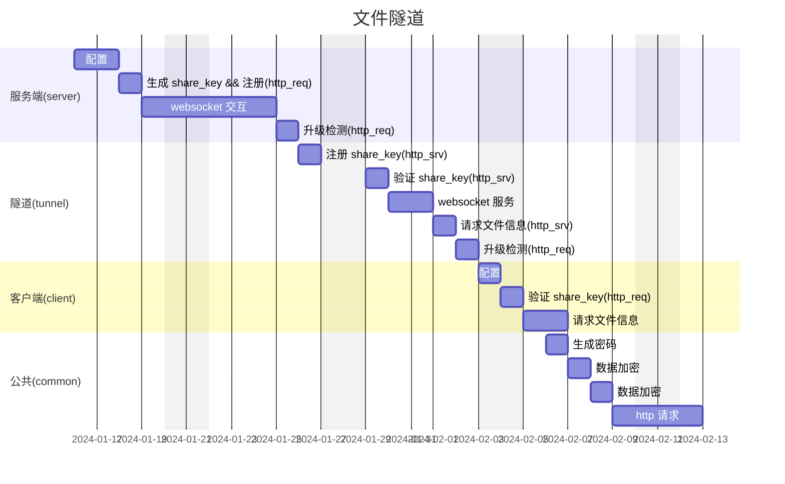

# 文件隧道 (file tunnel)
## 愿景
不受限制的使用自己的文件

## 模块
### [服务端](./readme/tunnel.md)
### 客户端
#### [发送端](./readme/server.md)
#### [接收端](./readme/client.md)

## 流程图

# 甘特图

[mermaid](https://mermaid.js.org/intro/)