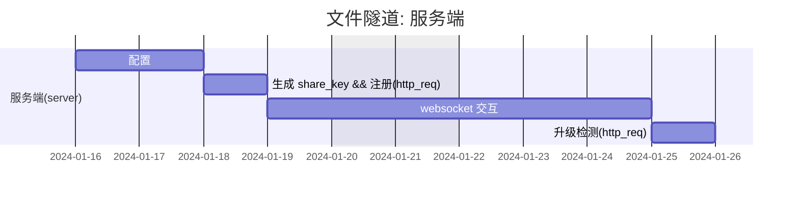

# 模块
客户端

# 运行
运行在用户主机上

# 说明
需要以后台服务方式常驻后台运行，主要用于获取数据，同步文件信息

# 功能
1. 配置
   - 文件路径
   - 密码
   - 自动生成共享key
2. 接收服务端指令
3. 加密并发送数据
4. 自我升级

# 甘特

```mermaid
gantt
   dateFormat YY-MM-DD
   title 文件隧道: 服务端
   excludes weekends
   section 服务端(server)
      配置: srv_config, 2024-01-16, 2d
      生成 share_key && 注册(http_req): gen_sk, 2024-01-18, 1d
      websocket 交互: ws_interact, 2024-01-19, 4d
      升级检测(http_req): srv_update, 2024-01-25, 1d
```